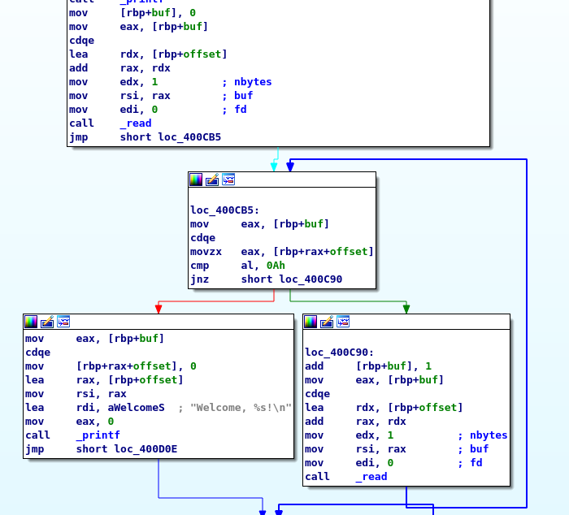

[](ctf=b01lers-ctf-2020)
[](type=pwm)
[](tags=buffer-overflow,rop)
[](tools=ropgadget,gdb,python)

# black hole

We are given a [binary](../black-hole) with a stack-based buffer overflow.

The buffer-overflow can be turned into an arbitrary write by overwriting a
variable on the stack which is used as the offset to the input buffer.
User input is read 1 byte at a time using repeated calls to `read` until a
newline character `\n` is encountered.



By overwriting the offset variable on the stack, we can overwrite the saved
return address and build a ROP chain.

I had so much trouble with alignment and testing this because I was running 
`Arch linux` and the server was running `Ubuntu 18.04`.

The solver script is [here](./solve.py).

```
$ python solve.py

...

Throttle: 3
Gravity: 17
O     =>                                           |
> $ d
You lose aaaaaaaaaaaaaaaaaaaaaaaaaaaaaaaaaaaaaaaaaaaaaaaaaaaaaaaaaaaaaaaaaaaaaaaaaaaaaaaaaaaaaaaaaaaaaaaaaaaaaaaaaaaaaaaaaaaaaaaaaaaaaaaaaaaaaaaaaaaa\xc0!
Sorry, you died!
You win, ./flag.txt!
pctf{th1s_l1ttle_man0uver_just_c0st_us_51_y34r5}

/home/black-hole/black-hole.sh: line 2:  2802 Segmentation fault      (core dumped) ./black-hole
[*] Got EOF while reading in interactive
$ 
[*] Interrupted
```
