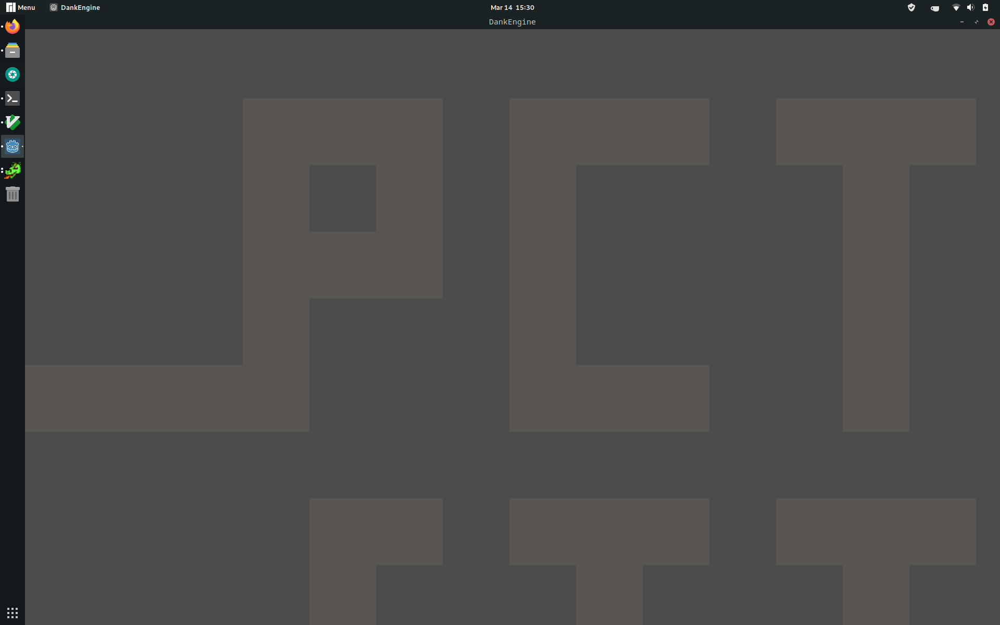

[](ctf=b01lers-ctf-2020)
[](type=reversing)
[](tags=game,re,godot)
[](toosl=ghidra)

# dank engine

We are given a [zip file](../DankEngine.zip). This consists of:

- DankEngine.pck
- DankEngine.x86\_64

`DankEngine.x86_64` is a game written with the Godot game engine. Running
`strings` on the `.pck` file, we can see that there is functionality to enable
`God Mode` in the game.

```
169 func zero_evt_release():                                                        
170     self.g_cheat_stack.push_back("0")                                           
171     if self.g_cheat_stack == ["P", "U", "R", "G", "0", "0"]:                    
172         self.g_god_mode = not self.g_god_mode                                   
173         $CollisionShape2D.disabled = not $CollisionShape2D.disabled 
```

All we have to do is enter 'PURG00' and then we can move arbitrarily in the
game map and travel through walls.

After travelling to the far-right in the map, we can see an image consisting of
the flag.



Flag: `pctf{itwastimeforthomastogo_hehadseeneverything}`
