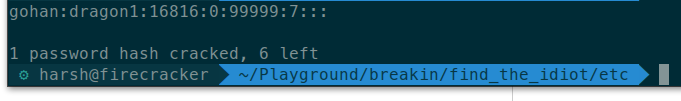

# Find The idiot (Score 100)
#### Forensics, Pwning

#### Question:

Your friend Bob, is an expert penetration tester. He loves solving and creating puzzles. He is invited by Pied Diaper Inc. for some testing. You join him for this technical expedition. At the site, you watch him work for a few minutes, when he exclaims, "What an idiot!". Then, he looks at you with a with a playful gaze. Then, handing out a flash drive to you he says, "Find the idiotic user". 
Link: [Here](find_the_idiot.zip)

The problem gives us a unix file system image as a zip. The friend is an expert in "Penetration Testing" which suggests that the system is vulnerable. We start by looking at:

/etc/passwd
/etc/shadow

We find 7 users and sha512crypt passwords. We then use a dictionary attack to bruteforce the ciphers for 7 users listed in the files above. Using a relatively large dictionary of frequent passwords we can easily crack 1 set of credentials :

gohan:dragon1:16816:0:99999:7:::

The flag is the password : "dragon1"
