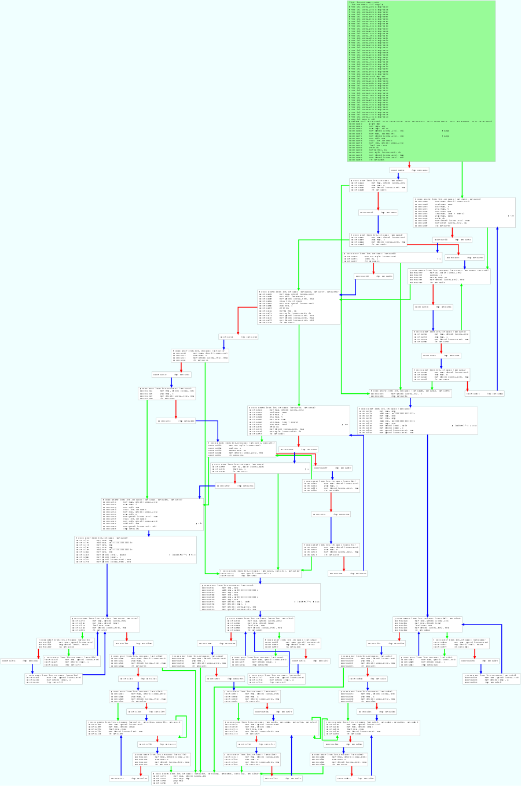

[](ctf=csaw-finals-2018)
[](type=reverse)
[](tags=fibonacci)
[](tools=radare2,r2)

# 1nsayne (rev-250) 

We are given a  [binary](../1nsayne).

```sh
$ file 1nsayne 
1nsayne: ELF 64-bit LSB executable, x86-64, version 1 (SYSV), dynamically linked, interpreter /lib64/ld-linux-x86-64.so.2, for GNU/Linux 3.2.0, stripped
```

On running it waits for some input. Input is later compared with so0per_cool.

```sh
$ ltrace -fbi ./1nsayne
[pid 25528] [0x400890] setvbuf(0x7f3ac22df760, 0, 2, 0)                                                               = 0
[pid 25528] [0x4038b5] fgets(lol
"lol\n", 99, 0x7f3ac22dea00)                                                             = 0x6042a0
[pid 25528] [0x4038c7] strchr("lol\n", '\n')                                                                          = "\n"
[pid 25528] [0x4036cb] strcmp("lol", "so0per_cool")                                                                   = -7
[pid 25528] [0xffffffffffffffff] +++ exited (status 0) +++
```

Simply passing so0per_cool as input starts printing some message.

```sh
$ ltrace -fbi ./1nsayne
[pid 26640] [0x400890] setvbuf(0x7f70174cb760, 0, 2, 0)                                                               = 0
[pid 26640] [0x4038b5] fgets(so0per_cool
"so0per_cool\n", 99, 0x7f70174caa00)                                                     = 0x6042a0
[pid 26640] [0x4038c7] strchr("so0per_cool\n", '\n')                                                                  = "\n"
[pid 26640] [0x4036cb] strcmp("so0per_cool", "so0per_cool")                                                           = 0
[pid 26640] [0x403119] strlen("so0per_cool")                                                                          = 11
[pid 26640] [0x403119] strlen("so0per_cool")                                                                          = 11
[pid 26640] [0x403119] strlen("so0per_cool")                                                                          = 11
[pid 26640] [0x403119] strlen("so0per_cool")                                                                          = 11
[pid 26640] [0x403119] strlen("so0per_cool")                                                                          = 11
[pid 26640] [0x403119] strlen("so0per_cool")                                                                          = 11
[pid 26640] [0x403119] strlen("so0per_cool")                                                                          = 11
[pid 26640] [0x403119] strlen("so0per_cool")                                                                          = 11
[pid 26640] [0x403119] strlen("so0per_cool")                                                                          = 11
[pid 26640] [0x403119] strlen("so0per_cool")                                                                          = 11
[pid 26640] [0x403119] strlen("so0per_cool")                                                                          = 11
[pid 26640] [0x403119] strlen("so0per_cool")                                                                          = 11
[pid 26640] [0x402b75] pow(1, 0, 0x403b00, 2)                                                                         = 0
[pid 26640] [0x402c16] sleep(5)                                                                                       = 0
[pid 26640] [0x402cd5] printf("%c", 'h'h)                                                                              = 1
[pid 26640] [0x402c16] sleep(5)                                                                                       = 0
[pid 26640] [0x402cd5] printf("%c", 'i'i)                                                                              = 1
```

Its printing some message byte-by-byte with some `sleep` in between. This should be easy to bypass using `desleep` from [preeny](https://github.com/zardus/preeny).

Even then it took more than a minute to print this much

```sh
$ LD_PRELOAD=~/tools/preeny/build_x64/lib/libdesleep.so ./1nsayne 
so0per_cool
hi! flag is
```

We have not reversed the file yet. Lets dig deeper using radare2.
Directly opening from entry0 and main I see that this binary has been obfuscated to some level using frequent `jmp`s and some dummy code, empty loops, random variables etc.
So to start simple I'll start by seeking to where the character was getting `printf`d from the ltrace logs 0x402cd5

```sh
$ r2 -AAAA 1nsayne
[x] Analyze all flags starting with sym. and entry0 (aa)
[x] Analyze function calls (aac)
[x] Analyze len bytes of instructions for references (aar)
[x] Constructing a function name for fcn.* and sym.func.* functions (aan)
[x] Enable constraint types analysis for variables
 -- Don't wait for Travis
[0x00400780]> s 0x402cd5
[0x00402cd5]> pd-20
│           ; CODE XREFS from sub.pow_b20 (0x402c63, 0x402ec0)
│           0x00402c82      48bf7c3b4000.  movabs rdi, 0x403b7c        ; '|;@' ; "%c"
│           0x00402c8c      488b45e0       mov rax, qword [local_20h]
│           0x00402c90      31c9           xor ecx, ecx
│           0x00402c92      89ca           mov edx, ecx
│           0x00402c94      48f775d0       div qword [local_30h]
│           0x00402c98      488b75d8       mov rsi, qword [local_28h]
│           0x00402c9c      89f1           mov ecx, esi
│           0x00402c9e      4863f1         movsxd rsi, ecx
│           0x00402ca1      488914f50843.  mov qword [rsi*8 + 0x604308], rdx ; [0x604308:8]=0
│           0x00402ca9      488b55d8       mov rdx, qword [local_28h]
│           0x00402cad      89d1           mov ecx, edx
│           0x00402caf      4863d1         movsxd rdx, ecx
│           0x00402cb2      488b14d58840.  mov rdx, qword [rdx*8 + 0x604088] ; [0x604088:8]=105
│           0x00402cba      488b75d8       mov rsi, qword [local_28h]
│           0x00402cbe      89f1           mov ecx, esi
│           0x00402cc0      4863f1         movsxd rsi, ecx
│           0x00402cc3      483314f50843.  xor rdx, qword [rsi*8 + 0x604308]
│           0x00402ccb      4889d6         mov rsi, rdx
│           0x00402cce      b000           mov al, 0
│           0x00402cd0      e81bdaffff     call sym.imp.printf         ; int printf(const char *format)
```

This block calculates `local_20h` % `local_30h`nd stores it to index `local_28h` an array of `qword` at 0x604308.
Later value is read and xored with `qword` at index `local_28h` of array at 0x604088 and is printed as a char.

Rename the variables to make sense

```sh
[0x00402cd5]> afvn mod local_30h
[0x00402cd5]> afvn idx local_28h
[0x00402cd5]> afvn some_value local_20h
```

As for the arrays 0x604088 has been initialized with some values and 0x604308 is all 0's.

```sh
[0x00604308]> s 0x604088
[0x00604088]> pxq 16
0x00604088  0x0000000000000069  0x000000000000006b   i.......k.......
[0x00604088]> s 0x604308
[0x00604308]> pxq 16
0x00604308  0x0000000000000000  0x0000000000000000   ................
[0x00604308]> 
```

The logic to dump chars is now

```python
for idx in xrange(unknown_1):
    putchar(arr_0x604088[idx] ^ (some_value % mod))
```

Seeking to the start of the current function we see that `mod` is set by some floating point calculations.

```sh
[0x00402cd5]> sf.
[0x00402b20]> pd30
┌ (fcn) sub.pow_b20 1484
│   sub.pow_b20 ();
....
│           ; CALL XREF from sub.strlen_f0 (0x403206)
│           0x00402b20      55             push rbp
│           0x00402b21      4889e5         mov rbp, rsp
│           0x00402b24      4881ec200100.  sub rsp, 0x120
│           0x00402b2b      48c745f80200.  mov qword [local_8h], 2
│           0x00402b33      31c0           xor eax, eax
│           0x00402b35      89c7           mov edi, eax
│           0x00402b37      e824f0ffff     call fcn.00401b60
│           0x00402b3c      488945f0       mov qword [local_10h], rax
│           0x00402b40      b901000000     mov ecx, 1
│           0x00402b45      89cf           mov edi, ecx
│           0x00402b47      e814f0ffff     call fcn.00401b60
│           0x00402b4c      488945e8       mov qword [local_18h], rax
│           0x00402b50      48c745e00000.  mov qword [some_value], 0
│           0x00402b58      48c745d80000.  mov qword [idx], 0
│           0x00402b60      f20f1005f00f.  movsd xmm0, qword [0x00403b58] ; [0x403b58:8]=0x4024000000000000
│           0x00402b68      f20f100df00f.  movsd xmm1, qword [0x00403b60] ; [0x403b60:8]=0x4033000000000000
│           0x00402b70      e8dbdbffff     call sym.imp.pow
│           0x00402b75      f20f100deb0f.  movsd xmm1, qword [0x00403b68] ; [0x403b68:8]=0x43e0000000000000
│           0x00402b7d      0f28d0         movaps xmm2, xmm0
│           0x00402b80      f20f5cd1       subsd xmm2, xmm1
│           0x00402b84      f2480f2cc2     cvttsd2si rax, xmm2
│           0x00402b89      48bf00000000.  movabs rdi, 0x8000000000000000
│           0x00402b93      4831f8         xor rax, rdi
│           0x00402b96      f2480f2cf8     cvttsd2si rdi, xmm0
│           0x00402b9b      660f2ec1       ucomisd xmm0, xmm1
│           0x00402b9f      480f42c7       cmovb rax, rdi
│           0x00402ba3      488945d0       mov qword [mod], rax
│       ┌─< 0x00402ba7      e963010000     jmp 0x402d0f
│       │   ; CODE XREFS from sub.pow_b20 (0x402d62, 0x402dc7, 0x403055, 0x4030bd)
│       │   0x00402bac      488b45d8       mov rax, qword [idx]
│       │   0x00402bb0      bf451c6b63     mov edi, 0x636b1c45
```

So `mod` should be a static value for this case. 
Looking around in Visual mode we can find that `some_value` is set directly from calling `fcn.00401b60` with `local_8h` as an argument

```sh
[0x00402b20]> s 0x402c0c
[0x00402c0c]> pd 20
│           ; CODE XREFS from sub.pow_b20 (0x402bed, 0x402e32, 0x402e73)
│           0x00402c0c      bf05000000     mov edi, 5
│           0x00402c11      e81adbffff     call sym.imp.sleep          ; int sleep(int s)
│           0x00402c16      488b7df8       mov rdi, qword [local_8h]
│           0x00402c1a      8945a4         mov dword [local_5ch], eax
│           0x00402c1d      e83eefffff     call fcn.00401b60
│           0x00402c22      488945e0       mov qword [some_value], rax
│           0x00402c26      488b7df8       mov rdi, qword [local_8h]
│           0x00402c2a      e871dcffff     call sub.sqrt_8a0
│           0x00402c2f      88c1           mov cl, al
│           0x00402c31      bf451c6b63     mov edi, 0x636b1c45
│           0x00402c36      8845a3         mov byte [local_5dh], al
│           0x00402c39      884da2         mov byte [local_5eh], cl
│           0x00402c3c      e83f0e0000     call fcn.00403a80
│           0x00402c41      8a4da3         mov cl, byte [local_5dh]
│           0x00402c44      0fb6f9         movzx edi, cl
│           0x00402c47      84c9           test cl, cl
│           0x00402c49      89459c         mov dword [local_64h], eax
│           0x00402c4c      897d98         mov dword [local_68h], edi
```

After `some_value` is called, `local_5dh` is set by calling `sub.sqrt_8a0` and depending on its value the character is printed
so now the eventual code is 

```python
idx = 0

for local_8h in xrange(unknown_1):
    some_value = fcn.00401b60(local_8h)
    local_5dh = sub.sqrt_8a0(local_8h)
    if local_5dh:
        printf(arr_0x604088[idx] ^ (some_value % mod))
        idx+=1

```

`mod` and `arr_0x604088` are constants, only variables are the result of functions -> `some_value` and `local_5dh`.

Opening them in visual mode show similar obfuscation.
graph for `fcn.00401b60`



Both functions take one argument and don't change any global variable. They call themselves recrsively or other functions with time consuming code. They have unnecessary loops and jumps that cause the program to run slow. We have seen similar challs in CTFs where simple constructs are written to waste time/CPU resources. We need to simplify these functions.

I tried to dynamically analyze the functions using this code. 

```python
import r2pipe

r2 = r2pipe.open("./1nsayne")
# reopen in debug mode
r2.cmd("doo")
r2.cmd("aaaa")

#set bp on entry
r2.cmd("db `ie~:1~[1]`")

#           0x00402c1d      e83eefffff     call fcn.00401b60
f1 = 0x00402c1d
r2.cmd("db 0x%x" % f1)
r2.cmd("db 0x%x" % (f1+5))

#           0x00402c2a      e871dcffff     call sub.sqrt_8a0
f2 = 0x00402c2a
r2.cmd("db 0x%x" % f2)
r2.cmd("db 0x%x" % (f2+5))

print r2.cmd("dbi")

r2.cmd("dc")

f1_m = []
f2_m = []

for i in xrange(32):
    r2.cmd("dr rip=0x%x" % f1)
    r2.cmd("dr rdi=0x%x" % i)
    r2.cmd("dc")
    f1_m.append(int(r2.cmd("dr rax"),16))

for i in xrange(32):
    r2.cmd("dr rip=0x%x" % f2)
    r2.cmd("dr rdi=0x%x" % i)
    r2.cmd("dc")
    f2_m.append(int(r2.cmd("dr rax"),16))

r2.quit()

print f1_m
print f2_m
```

What I'm doing here is I'm calling `fcn.00401b60` and `sub.sqrt_8a0` with argument in [0..32] so that I can predict or analyze the output which was

```python
[0, 1, 1, 2, 3, 5, 8, 13, 21, 34, 55, 89, 144, 233, 377, 610, 987, 1597, 2584, 4181, 6765, 10946, 17711, 28657, 46368, 75025, 121393, 196418, 317811, 514229, 832040, 1346269]
[0, 0, 1, 1, 0, 1, 0, 1, 0, 0, 0, 1, 0, 1, 0, 0, 0, 1, 0, 1, 0, 0, 0, 1, 0, 0, 0, 0, 0, 1, 0, 1]
 ```
 
 First output is fibonacci numbers, so  `fcn.00401b60(i)` returns `fibonacci(i)`. Thats why it was taking a lot of time for later bytes of the flag. This computation is recursive with no memoization.

 Second output doesn't make sense as now, but `sub.sqrt_8a0(i)` returns if `i` is prime or not.

 Now we have all we need. We only have to dump `arr_0x604088`.

 ```sh
[0x00604088]> pxQ 62*8~[1]
0x0000000000000069
0x000000000000006b
0x0000000000000024
0x000000000000002d
```

Final code to dump the flag 

```python
from Crypto.Util.number import isPrime
mod = 0x8ac7230489e80000

def fib(n, _cache={}):
    '''efficiently memoized recursive function, returns a Fibonacci number'''
    if n in _cache:
        return _cache[n]
    elif n > 1:
        return _cache.setdefault(n, fib(n-1) + fib(n-2))
    return n

'''
[0x00604088]> pxq 62*8
'''
flag = ''

arr_0x604088 = [0x0000000000000069, 0x000000000000006b, 0x0000000000000024, 0x000000000000002d, 0x000000000000003f, 0x0000000000000085, 0x000000000000065c, 0x0000000000001032, 0x0000000000006fd1, 0x000000000007d8dc, 0x0000000000148aae, 0x0000000001709e43, 0x0000000009de8d4d, 0x0000000019d699c3, 0x00000000b119248d, 0x0000000c69e60a04, 0x000000dec113965e, 0x000002472d96a972, 0x000028e0b4bf2bb9, 0x0001182e2989cebd, 0x0002dd8587da6e47, 0x00336a82d89c9330, 0x016069317e428cf6, 0x18b3c1d91e77de9d, 0x3240e2d181223220, 0x2baf6373dbe838b6, 0x073950ec18c5313e, 0x41838009bc58e07c, 0x4fc6cdc83cbb455a, 0x19568517131788a2, 0x030f7bd5f7e4a029, 0x67f7e718178ec0e7, 0x014b63ebbe1f7469, 0x6fd5280bc8cbb8ba, 0x493f53f1269e0b1c, 0x3f94756512a1ef8c, 0x374f52aaa0d0553d, 0x6354887f00940f76, 0x7c63c3b79148c8f9, 0x1a72a23c580389e4, 0x4a1d5e7d8b26e807, 0x68824ddf2c14b0be, 0x0988b22957af8bde, 0x005a365e21fdb4b9, 0x70febf7992c701ec, 0x45e80772963b72e3, 0x5b656a15e45ad6b4, 0x4d858b58f9cec52f, 0x4b85e107e3108430, 0x24c6b1482aff1e90, 0x43a3e729aec76a88, 0x1fc747c217b50012, 0x4af69f78486233fe, 0x1a5964ce9b71f58d, 0x6cb1150f7bf8ab6f, 0x7dfd4f0d1b421262, 0x4d736c985a149eca, 0x762bc1ac0419dd9e, 0x39deb71e84b24129, 0x80072969eea6cc22, 0x5ad24c5e14feb5a9, 0x454e2d665f785a38]
idx = 0
i = 0

while True:
    if idx == 62:
        break
    if isPrime(i):
        flag += chr((arr_0x604088[idx] ^ (fib(i) %  mod)) % 0xff)
        idx += 1
    i += 1

print flag
```

prints

> hi! flag is: flag{LlvM_Passes_4nD_9atCh1ng_8inaryies_4r3_c0ol}