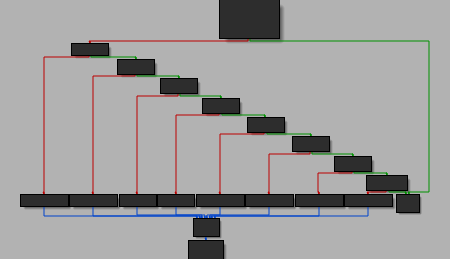

[](ctf=csaw-finals-2021)
[](type=reverse)
[](tags=ida)
[](tools=ida)

# maze (re)

```sh
[csaw2021-fin] file maze_public
maze_public: ELF 64-bit LSB executable, x86-64, version 1 (SYSV), statically linked, stripped
```

maze is a simple ELF file without any tricks. A simple `start` to read flag, check and return

```c
sys_write(1u, buf, 0x1AuLL);
sys_read(0, input, 0x64uLL);
x = sub_403EB6(input); // use r15 as return
if (x == 0x40){
    v2 = sys_write(1u, aWellDonePlease, 0x3BuLL);
} else {
    v2 = sys_write(1u, aTryAgain, 0xCuLL);
}
sys_exit(1);
```
`sub_403EB6` is a simple function too. Only thing is `.text` is mapped `rwx` and this function patches entry to ret `c3` on return such that any next call is a no-op and ret.

The logic is pretty straightforward too.


It reads the first byte from the flag and considers it as a digit. If the digit is in 1-8 range then a tuple of values is set and used to calculate a jump.

Looking at the destination of the jump we find that there are multiple copies of the same `sub_403EB6` with the same code. So the binary is basically and array of same check functions that continue jumping to each other and return if you call the same function twice.

Additionally there are some dummy ret's placed on some destination jumps as well which are like an instant fail. To get the good boy message you need to call exactly all of 0x40 functions once as each function increments `r15`.

```python
In [3]: e = ELF("maze_public")
    Arch:     amd64-64-little
    RELRO:    No RELRO
    Stack:    No canary found
    NX:       NX disabled
    PIE:      No PIE (0x400080)
    RWX:      Has RWX segments

In [4]: e.read(0x403EB6, 0x403F83-0x403EB6) == e.read(0x403F83, 0x404050-0x403F83)
Out[4]: True
```

Based on this the destination formula is something like this and that's basically all the logic.

```python
inp = "12345"
mp = [(-2, 1), (-1, 2), (1, 2), (2, 1), (2, -1), (1, -2), (-1, -2), (-2, -1)]
r15 = 0
curr = 51
for i in inp:
    r15 += 1
    movx, movy = mp[ord(i)-ord("1")]
    curr += movx*12 + movy
```

We need to find out what jmp targets are actual functions that would be called first time and not just rets. All functions - valid or dummy are placed at same distance and `pwntools.ELF` can be used to read the first byte - valid ones would not have `ret`

Now looking at this I found that there is a pattern - 8 valid functions followed by 4 rets. A total of (8+4)*12 = 96 places out of which 64 were valid.

I thought of this as a graph theory problem where the neighbours are valid targets. The solution needs that we traverse each node exactly once and visit all nodes - basically a hamiltonian path.

A dot file can be generated to load in `networkx` which already has a lot of graph theory related algorithms

```python
g = [[] for i in range(96)]
print("strict graph x {")
for i in range(96):
    if z[i][1]!=72:
        continue
    for j in mp:
        movx, movy = j
        dst = i + movx*12 + movy
        if dst >= 0 and dst < 96 and z[dst][1]==72:
            print("%d -- %d" % (i, dst))
            g[i].append(dst)
print("}")
```

and then find the hamiltonian path with source as `sub_403EB6` which was the 51st member of the array and hence 35th valid node.

```python
import networkx as nx
import sys
def hamilton(G):
    F = [(G,['35'])]
    n = G.number_of_nodes()
    while F:
        graph,path = F.pop()
        confs = []
        neighbors = (node for node in graph.neighbors(path[-1])
                     if node != path[-1]) #exclude self loops
        for neighbor in neighbors:
            conf_p = path[:]
            conf_p.append(neighbor)
            conf_g = nx.Graph(graph)
            conf_g.remove_node(path[-1])
            confs.append((conf_g,conf_p))
        for g,p in confs:
            if len(p)==n:
                return p
            else:
                F.append((g,p))
    return None

g = nx.drawing.nx_agraph.read_dot("./a.dot")
path = hamilton(g)
print(path)
mp = [(-2, 1), (-1, 2), (1, 2), (2, 1), (2, -1), (1, -2), (-1, -2), (-2, -1)]
mpd = [-23, -10, 14, 25, 23, 10, -14, -25]
last = 0
for i in path:
    u = int(i)
    u = (u//8)*12 + (u%8)
    # print(u, file=sys.stderr)
    if last != 0:
        print(mpd.index(u-last)+1,end="")
    last = u
```

This gives us one valid input

```sh
(test3) [csaw] ./maze_public
Please type your input:
431638527527572572527527223163816467611642134676813236166612477
Well done! Please validate the input on the remote server
```
