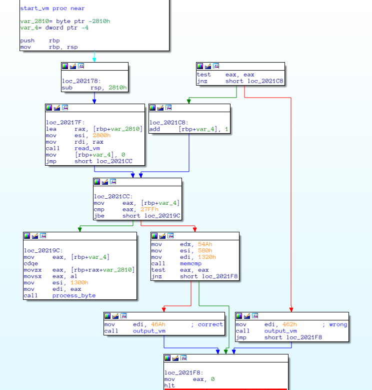
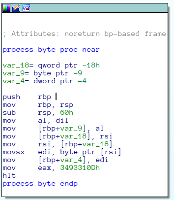
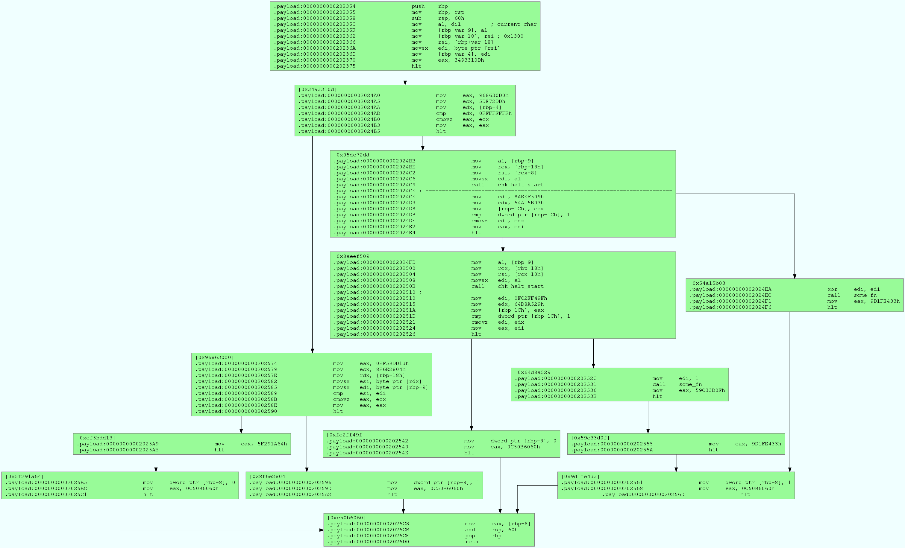
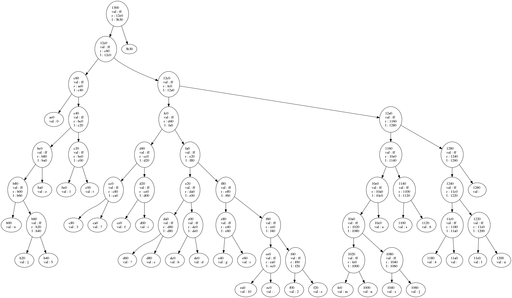

[](ctf=csaw-finals-2018)
[](type=reverse)
[](tags=tree)
[](tools=ida, r2)

# kvm (rev-500)

```
Reversing
kvm

We found a mysterious program that none of our most talented hackers could even begin to figure out.

Author: toshi

Solves: 58
```

We are given a [file](../chall-500-kvm.elf)

This sets up a vm and a vcpu using KVM apis. An area is mmaped between both machines loaded at 0x0 in guest. Then `_payload` from the binary is copied to this area and `rip` is set to 0. This means code for vm begins at `0x202174` and probably ends at `0x20348C`

Code at `0x202174` is quite straight forward:



First it reads 0x2800 bytes, then it calls `process_byte` on every byte. This call should return 1 otherwise it goes to "Wrong" message. Aftet this `memcmp` is called to match two memory regions at addresses `0x1320` and `0x580` which also decide Correct/Wrong message.

#### process_byte

This is where the challenge starts. First basic block comes to an abrupt `hlt`



Looking at the function that starts the VM with KVM_RUN, there's a handler to handle IO and check when machine halts;

```c
if ( ioctl(*(_DWORD *)a2, 0x8090AE81uLL, &v7) < 0 )
 {
   perror("KVM_GET_REGS");
   exit(1);
 }
 result = v7.rax;
 if ( !v7.rax )
   return result;
 v4 = jumper_fn(v7.rax);
 v7.rip = v4;
 if ( ioctl(*(_DWORD *)a2, 0x4090AE82uLL, &v7) < 0 )
 {
   perror("KVM_SET_REGS");
   exit(1);
 }

 __int64 __fastcall jumper_fn(int a1)
{
  __int64 *v1; // rdx
  __int64 v2; // rdx
  __int64 result; // rax
  int i; // [rsp+1Ch] [rbp-14h]

  for ( i = 0; ; ++i )
  {
    if ( i >= dword_202170 )
    {
      fwrite("Error - bug the organizer\n", 1uLL, 0x1AuLL, stderr);
      exit(1);
    }
    if ( LODWORD(qword_2020A0[2 * i]) == a1 )
      break;
  }
  v1 = &qword_2020A0[2 * i];
  result = *v1;
  v2 = v1[1];
  return (unsigned int)result;
}
```

Based on what `rax\eax` contains `rip` is updated to new value in the vm according to

```python
   {
    0xC50B6060: 0x454
    0x9D1FE433: 0x3ED
    0x54A15B03: 0x376
    0x8F6E2804: 0x422
    0x8AEEF509: 0x389
    0x3493310D: 0x32C
    0x59C33D0F: 0x3E1
    0x968630D0: 0x400
    0xEF5BDD13: 0x435
    0x64D8A529: 0x3B8
    0x5F291A64: 0x441
    0x05DE72DD: 0x347
    0xFC2FF49F: 0x3CE
    }
```

This opens up a lot of code to analyze with similar  `mov eax, const; hlt` pattern.
I use a little r2 and dot to generate this file to look at the code easily.



Now we can ignore `hlt` and consider this as one function with the following pseudocode

```python
def process_byte(byte, idx):
    c = some_arr[idx]
    if c == 0xff:
        t = process_byte(byte, idx+8)
        if t == 1:
            write_bit(0)
            return 1
        else:
            t = process_byte(byte, idx+0x10)
            if t == 1:
                write_bit(1)
                return 1
    else:
        if byte == c:
            return 1
        else:
            return 0
```

This is basically like a dfs search for the byte provided. Based on where the byte is found in the tree `write_bit` is called with `1\0` which writes the bit to 0x1320.
0x1320 is used in `memcmp` to determine the correct/wrong.

The tree root is at address `0x203474` which is (0x1300+0x202174) as `process_byte` is always called from `start_vm` as `process_byte(byte, 0x1300)`

The problem now is given some data and the ability to write 1/0 to other region, we make them match.

The tree looks like this:



Based on whether a right/left is taken to traverse to the leaf node a 1/0 is written respectively. This way we can write to

Now we have some bitstrings for each leaf node and the final bit string to be written, we need to find the right order that will fit in 0x2800 bytes.

```python
  {
  '0001110': '4'
  '11111010': 'e'
  '110110': '6'
  '0001010': '?'
  '00111010': '\n'
  '1011010': 'r'
  '10100': 'o'
  '000010': '3'
  '01100': '1'
  '1101010': 'd'
  '1101110': 'u'
  '1': '\x00'
  '100010': '7'
  '1100100': '5'
  '110010': 'i'
  '010010': 'f'
  '10000110': 'n'
  '0011010': 'g'
  '010110': 's'
  '11000110': '{'
  '000': '0'
  '00000110': 'm'
  '01111010': '2'
  '10111010': '.'
  '01000110': 'x'
  '0100100': '}'
  '0101110': 'l'
  '11100': 't'
  '100110': 'a'
  '0101010': 'b'
  '000100': 'w'
  '1001110': 'h'
  '1001010': 'c'
  '11110': ' '
  }
```

This is similar to word break problem and can be solved recursively/dp.
Dump the reference memory region `0x580` of length `0x54a` and solve.

```python
dump = open("dump", "rb").read()
s = "".join(map(lambda x:format(x, '08b')[::-1], map(ord, list(dump))))

def solve(str, n, result):
    for i in xrange(1,n+1):
        substr = str[:i]
        if substr in smi:
            if i == n:
                result += substr
                print result
                break
            solve(str[i:], n-i, result+substr+" ")

solve(s, len(s), "")
```

The string that was generated was a TAR archive with the flag.
[Full script](solve.py)
