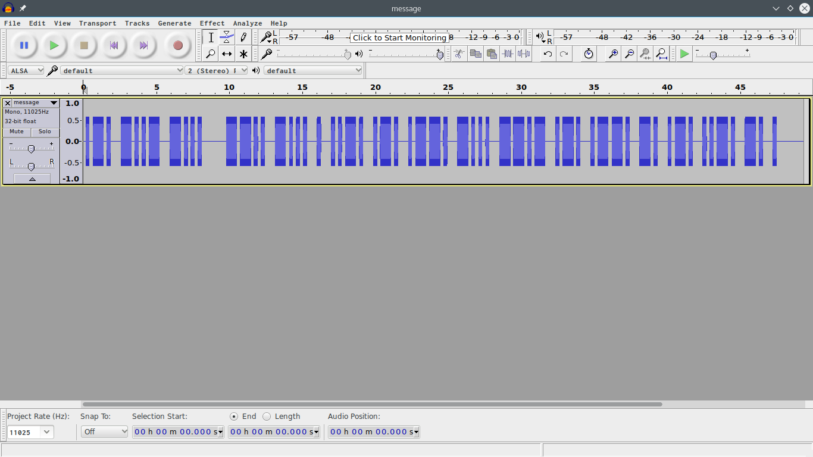

[](ctf=ekoparty-2015)
[](type=crypto)
[](tags=morse,ceasar)
[](tools=audacity)
[](techniques=)

# Classic Crypto (crypto-50)

We are given an [audio file](../message.mp3). Let's open it up in [Audacity](http://audacityteam.org/)



Looks like morse code. Let's write it down:
```
.-. -..- -...  --.. -... . ..-. .-. .--. -... --.- .-. .--. -. .-. ..-. -. .
```
Tried out an [online morse code decoder](http://morsecode.scphillips.com/translator.html) and got:
```
RXBZBEFRPBQRPNRFNE
```
Looks like we need to something more, maybe ceasar?

Let's print out all 26 shifts:
```
lrvtvyzljvkljhlzhy
mswuwzamkwlmkimaiz
ntxvxabnlxmnljnbja
ouywybcomynomkockb
pvzxzcdpnzopnlpdlc
qwayadeqoapqomqemd
rxbzbefrpbqrpnrfne
sycacfgsqcrsqosgof
tzdbdghtrdstrpthpg
uaecehiusetusquiqh
vbfdfijvtfuvtrvjri
wcgegjkwugvwuswksj
xdhfhklxvhwxvtxltk
yeigilmywixywuymul
zfjhjmnzxjyzxvznvm
agkiknoaykzaywaown
bhljlopbzlabzxbpxo
cimkmpqcambcaycqyp
djnlnqrdbncdbzdrzq
ekomorsecodecaesar
flpnpstfdpefdbftbs
gmqoqtugeqfgecguct
hnrpruvhfrghfdhvdu
iosqsvwigshigeiwev
jptrtwxjhtijhfjxfw
kqusuxykiujkigkygx
```

Aand there's the flag
> EKO{MORSECODECAESAR}
