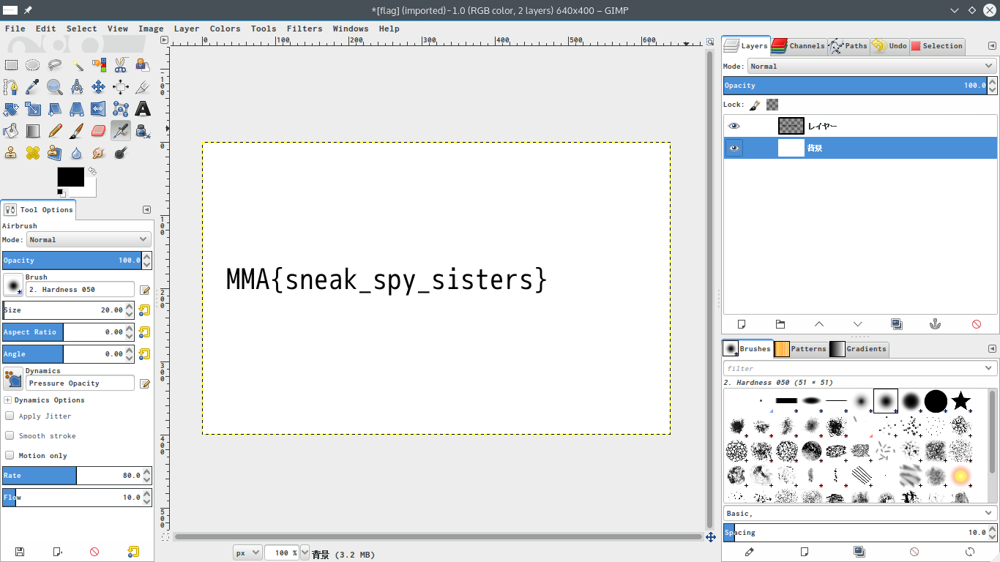

[](ctf=mma-ctf-2015)
[](type=forensics)
[](tags=)
[](tools=wireshark,gimp)
[](techniques=)

# Splitted (forensics-30)

We're given [a pcap file](../splited.pcap), let's go ahead and open it in wireshark. We can easily see that a file called 'flag.zip' is being sent.. Let's filter required packets:
> http && ip.src==192.168.4.10

We see 8 packets, so exported all the 8 packets as HTTP objects (File > Export Objects.. > HTTP).

From wireshark we can the range of each HTTP response,  as follows.

Packet No | Range start
----------|------------
16        | 2345
26        | 0
36        | 1407
46        | 2814
56        | 3283
66        | 469
76        | 938
86        | 1386

Sorted them according to range start

Packet No | Range start
----------|------------
26        | 0
66        | 469
76        | 938
86        | 1386
36        | 1407
16        | 2345
46        | 2814
56        | 3283

Renamed the exported packets to follow this order, and assembled them:
```bash
$ mv packet-26 part-1.zip
$ mv packet-66 part-2.zip
$ mv packet-76 part-3.zip
$ mv packet-86 part-4.zip
$ mv packet-36 part-5.zip
$ mv packet-16 part-6.zip
$ mv packet-46 part-7.zip
$ mv packet-56 part-8.zip
$ cat part-*.zip > flag.zip
$ unzip flag.zip
```
We see a file called 'flag.psd'. Opening it in GIMP, we see flag in the bottom layer



> MMA{sneak_spy_sisters}
