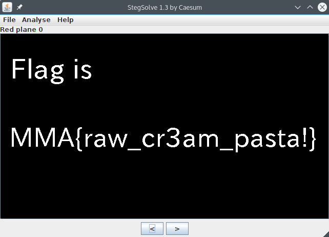

# Nagoya Castle (stego-100)

One image was given:

It was simpler than I expected. Downloaded the image, opened it in [StegoSolve](http://www.caesum.com/handbook/Stegsolve.jar).

Aand there's our flag
> MMA{raw_cr3am_pasta!}
