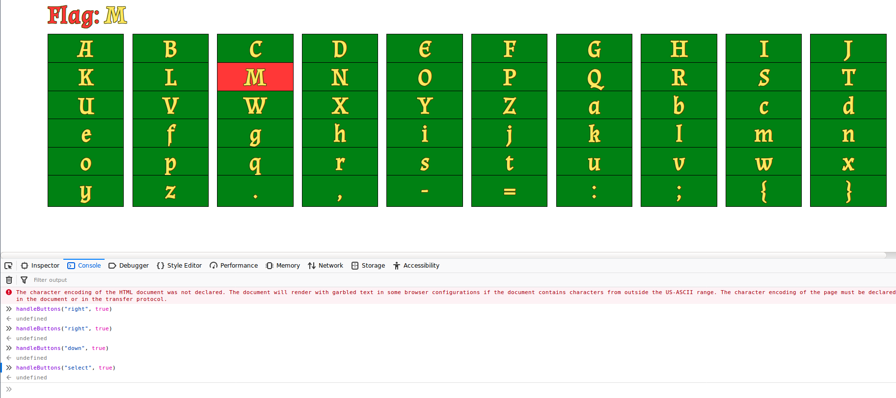
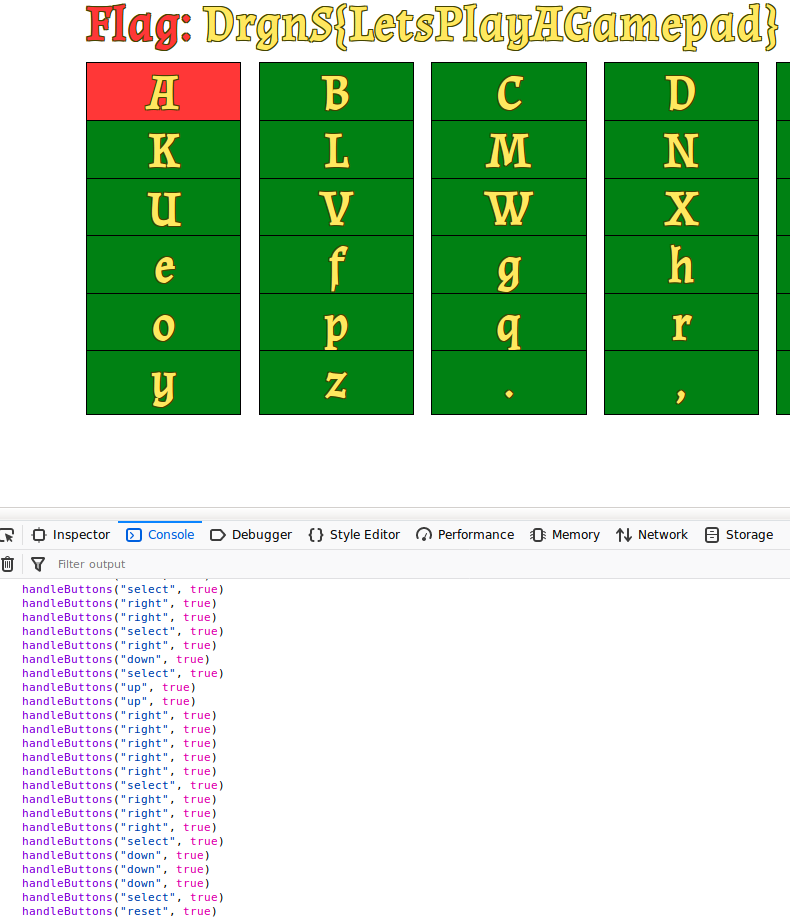

[](ctf=teaser-dragon-ctf-2019)
[](type=misc)
[](tags=pcap,html5,usb)
[](tools=wireshark,tshark)

# PlayCAP

We are given an [HTML5 application](../app.html) and a [pcagng](../PlayCAP.pcapng).

The packet capture file has a bunch of USB traffic (`URB Interrupt` packets). More information about the USB filter fields can be found at the [Wireshark USB reference page](https://www.wireshark.org/docs/dfref/u/usb.html).

```sh
$ tshark -r ../PlayCAP.pcapng -V | less
Frame 1: 36 bytes on wire (288 bits), 36 bytes captured (288 bits) on interface 0
    Interface id: 0 (\\.\pipe\wireshark_extcap_\\.\USBPcap1_20190918154451)
        Interface name: \\.\pipe\wireshark_extcap_\\.\USBPcap1_20190918154451
    Encapsulation type: USB packets with USBPcap header (152)
    Arrival Time: Sep 18, 2019 19:16:10.716963000 IST
    [Time shift for this packet: 0.000000000 seconds]
    Epoch Time: 1568814370.716963000 seconds
    [Time delta from previous captured frame: 0.000000000 seconds]
    [Time delta from previous displayed frame: 0.000000000 seconds]
    [Time since reference or first frame: 0.000000000 seconds]
    Frame Number: 1
    Frame Length: 36 bytes (288 bits)
    Capture Length: 36 bytes (288 bits)
    [Frame is marked: False]
    [Frame is ignored: False]
    [Protocols in frame: usb]
USB URB
    [Source: host]
    [Destination: 1.8.0]
    USBPcap pseudoheader length: 28
    IRP ID: 0xffffda046b5cc010
    IRP USBD_STATUS: USBD_STATUS_SUCCESS (0x00000000)
    URB Function: URB_FUNCTION_GET_DESCRIPTOR_FROM_DEVICE (0x000b)
    IRP information: 0x00, Direction: FDO -> PDO
        0000 000. = Reserved: 0x00
        .... ...0 = Direction: FDO -> PDO (0x0)
    URB bus id: 1
```

Checking the vendor (`0x57e`) and product (`0x2009`) ids of the USB device with help from google tells us the traffic is from a *Nintendo Switch controller* : [360Controller/issues/632](https://github.com/360Controller/360Controller/issues/632).

```sh
tshark -r ../PlayCAP.pcapng -e usb.idProduct -e usb.idVendor -Tfields  | less
```

The following kernel patch has more information about the specific fields we're interested in : [patch/10761581/](https://patchwork.kernel.org/patch/10761581).

Going through [app.html](../app.html), we find the following interesting information:

```javascript
...
      checkChange(pad.buttons, 'left', 14);  // Direction buttons.
      checkChange(pad.buttons, 'right', 15);
      checkChange(pad.buttons, 'up', 12);
      checkChange(pad.buttons, 'down', 13);
      checkChange(pad.buttons, 'reset', 3);  // X
      checkChange(pad.buttons, 'select', 1);  // A
...
```

We can control the on-screen keyboard with the `handleButtons` function.



Going through the kernel patch gives us the following snippet of code which contains the information for translating our USB leftover capture data into the corresponding gamepad buttons.

```c
...
> +               /* Parse digital buttons */
> +               ctlr->but_y             = 0x01 &amp; data[3];
> +               ctlr->but_x             = 0x02 &amp; data[3];
> +               ctlr->but_b             = 0x04 &amp; data[3];
> +               ctlr->but_a             = 0x08 &amp; data[3];
> +               ctlr->but_sr_right_jc   = 0x10 &amp; data[3];
> +               ctlr->but_sl_right_jc   = 0x20 &amp; data[3];
> +               ctlr->but_r             = 0x40 &amp; data[3];
> +               ctlr->but_zr            = 0x80 &amp; data[3];
> +               ctlr->but_l             = 0x40 &amp; data[5];
> +               ctlr->but_zl            = 0x80 &amp; data[5];
> +               ctlr->but_minus         = 0x01 &amp; data[4];
> +               ctlr->but_plus          = 0x02 &amp; data[4];
> +               ctlr->but_rstick        = 0x04 &amp; data[4];
> +               ctlr->but_lstick        = 0x08 &amp; data[4];
> +               ctlr->but_home          = 0x10 &amp; data[4];
> +               ctlr->but_capture       = 0x20 &amp; data[4];
> +               ctlr->but_down          = 0x01 &amp; data[5];
> +               ctlr->but_up            = 0x02 &amp; data[5];
> +               ctlr->but_right         = 0x04 &amp; data[5];
> +               ctlr->but_left          = 0x08 &amp; data[5];
> +               ctlr->but_sr_left_jc    = 0x10 &amp; data[5];
> +               ctlr->but_sl_left_jc    = 0x20 &amp; data[5];
...
```

We can dump the USB leftover capture data using Wireshark and solve the challenge by calling `handleButtons` with the correct order of commands.

```sh
$ tshark -r PlayCAP.pcapng -Y "usb.transfer_type==0x01 && frame.len==91 && usb.endpoint_address.direction==IN" -e usb.capdata -Tfields > usbcap.txt
```

The solution script is present in [solve.py](solve.py).

```sh
$ python3 solve.py
handleButtons("reset", true)
handleButtons("reset", true)
handleButtons("reset", true)
handleButtons("reset", true)
handleButtons("right", true)
handleButtons("right", true)
handleButtons("right", true)
handleButtons("select", true)
handleButtons("down", true)
handleButtons("down", true)
...
```



Flag: `DrgnS{LetsPlayAGamepad}`
