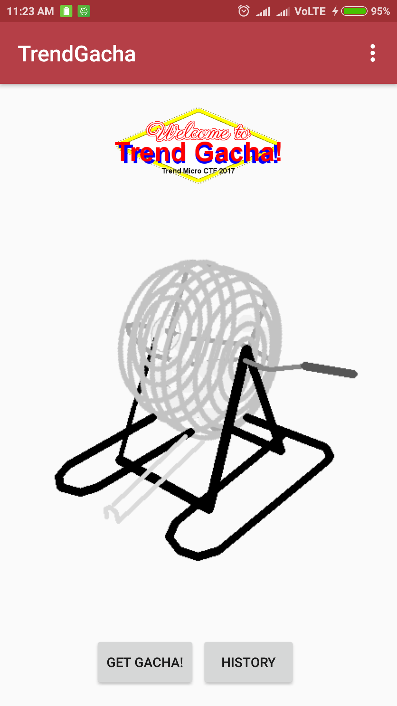

[](ctf=trend-micro-ctf-2017)
[](type=analysis,reverse)
[](tags=android)
[](tools=jd-gui,dex2jar)
[](techniques=bruteforce)

# analysis-offensive 300

*Disclaimer : This is not the smart way to do this, but its easy if you have an android development setup.*

So we have an apk file.
```bash
$ file TrendGacha.apk
TrendGacha.apk: Zip archive data, at least v2.0 to extract
$ unzip -qq TrendGacha.apk -d TrendGacha
$ ls TrendGacha
AndroidManifest.xml  classes.dex  lib  META-INF  res  resources.arsc
$ cd TrendGacha
$ ~/tools/dex2jar/d2j-dex2jar.sh classes.dex
dex2jar classes.dex -> ./classes-dex2jar.jar
```

I also installed the apk on a device to test it.



The functions are quite simple. When you click on `GET GACHA!` it'll choose a character of the flag and give it to you. All your leaked chars can then be seen later in the `HISTORY`.

Looking in the output of jd-gui on the jar. The code for `GET GACHA!`.

```java
public void run()
      {
        Intent localIntent = new Intent("com.tm.ctf.trendgacha.GET_GACHA");
        if (a.N() == null) {
          a.b(a.this.i().getApplicationContext());
        }
        a.N().sendBroadcast(localIntent);
        a.a(a.this, true);
      }
```
So the button sends a com.tm.ctf.trendgacha.GET_GACHA intent via broadcast which is then handled by GachaBroadcastReceiver.

```java
public void onReceive(Context paramContext, Intent paramIntent)
  {
    Log.i(a, "onReceive: action=" + paramIntent.getAction());
    if (!paramIntent.getAction().equals("com.tm.ctf.trendgacha.GET_GACHA")) {
      return;
    }
    paramIntent = paramIntent.getExtras();
    if (paramIntent != null) {}
    for (int i = Integer.valueOf(paramIntent.getString("TryLoop", "1")).intValue();; i = 1)
    {
      for (int j = 0; j < i; j++)
      {
        d.b(paramContext.getApplicationContext());
        int n = d.a(paramContext.getApplicationContext());
        paramIntent = GachaAPI.getGacha(n);
        int k = paramIntent[0];
        char c1 = (char)paramIntent[1];
        d.a(paramContext.getApplicationContext(), k, c1);
        int m = d.b(paramContext.getApplicationContext(), k, c1);
        Log.i(a, "TrialCount: " + n + ", Order: " + k + ", Gacha: " + c1 + ", Count: " + m);
        paramIntent = c.iterator();
        while (paramIntent.hasNext()) {
          ((b)paramIntent.next()).b_();
        }
        Toast.makeText(paramContext, "Got \"" + k + "-" + c1 + "\" !", 0).show();
        if (n < 10) {
          Toast.makeText(paramContext, "Check History!", 0).show();
        }
      }
      break;
    }
  }
}
```
This will leak a byte of the flag. We also see a variable `TryLoop` which will repeat the leak `TryLoop` times. Whenever we press the `GET GACHA!` button `TRIAL_COUNT` is increased in the SharedPreferences. The `GachaAPI.getGacha` is called on the value of `TRIAL_COUNT`. Its good that we can broadcast intents via adb so that we can set `TRIAL_COUNT` to a very high value.

```bash
$ adb shell am broadcast -a com.tm.ctf.trendgacha.GET_GACHA -e TryLoop 100
Broadcasting: Intent { act=com.tm.ctf.trendgacha.GET_GACHA (has extras) }
Broadcast completed: result=0
```
Hoever this only leaks a few bytes of the flag which we can view in History. I tried to set the number to 10000 and more but the process was slow and I got bored.


Looking into the source of `GachaAPI.getGacha` we see that it loads a native library.

```java
package com.tm.ctf.trendgacha;

public class GachaAPI
{
  static
  {
    System.loadLibrary("native-lib");
  }

  public static native int[] getGacha(int paramInt);
}
```
If only I could run `getGacha` with my parameters. I never did much development in Android, so I downloaded Android Studio, added `com.tm.ctf.trendgacha` in a sample app from the decompiled source and added the jniLibs to include `native-lib`. I added the following code in an activity to retrieve and save the flag to a file.

```java
protected void onCreate(Bundle savedInstanceState) {
        super.onCreate(savedInstanceState);
        setContentView(R.layout.activity_card_view);
        Log.i(TAG,"AAAAAAAAAAAAAAAAAAAAAAAAAAAAAAA");
        int i = 1;
        for(i = 1 ; i < 1000000 ; ++i){
            int[] x = GachaAPI.getGacha(i);
            appendLog("Result : " +(char)x[1] + " : " + Arrays.toString(x) );
        }
    }
```
This succesfully gave me the flag. Just later I realized that I could have controlled the parameter to `GachaAPI.getGacha` from the `TRIAL_COUNT` in SharedPreferences. SharedPreferences are usually saved in XML format in /data/data/< appname >/shared_prefs/*.xml. But we need root on the device to pull and push these files. So to test this I set up a new AVD (already rooted!) and installed the app.

```bash
$ ~/Android/Sdk/platform-tools/adb pull /data/data/com.tm.ctf.trendgacha/shared_prefs/PREFERENCES.xml
/data/data/com.tm.ctf.trendgacha/shared_... pulled. 0.2 MB/s (1892 bytes in 0.009s)
```
In PREFERENCES.xml I increased the `TRIAL_COUNT`.
```xml
<int name="TRIAL_COUNT" value="3000863" />
```
And then pushed it back and restarted the application.
```bash
$  ~/Android/Sdk/platform-tools/adb push PREFERENCES.xml /data/data/com.tm.ctf.trendgacha/shared_prefs/PREFERENCES.xml
PREFERENCES.xml: 1 file pushed. 0.2 MB/s (1893 bytes in 0.009s)
$  ~/Android/Sdk/platform-tools/adb  shell am broadcast -a com.tm.ctf.trendgacha.GET_GACHA -e TryLoop 100
Broadcasting: Intent { act=com.tm.ctf.trendgacha.GET_GACHA (has extras) }
Broadcast completed: result=0
```

This will give us the flag.


