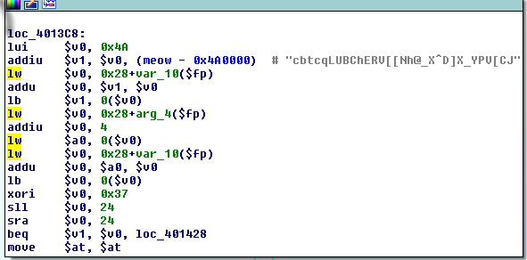
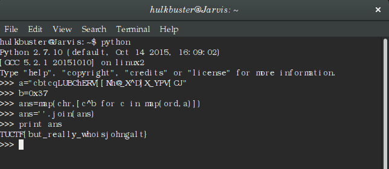

***REV 50***

*category:reverse engineering*  *points:50*

If we analyse the given binary file we find that it is a 32-bit LSB executable.

```bash
hulkbuster@Jarvis:~/Downloads$ file e7453ba07805c6bab5a0b95f57aaeb6e70af76b1
e7453ba07805c6bab5a0b95f57aaeb6e70af76b1: ELF 32-bit LSB executable, MIPS, MIPS-II version 1 (SYSV), statically linked, for GNU/Linux 2.6.32, BuildID[sha1]=1d5c00adcd4cbb883fea12bc860f827d023e416f, not stripped
```

Open with IDA pro. If we read the program flow starting from the main function,we arrive at point where after reading we understand that it is a XOR'ing of characters with the address **0x37**.



open python shell and the XOR to get the flag.



TEAM BYTEBANDITS
