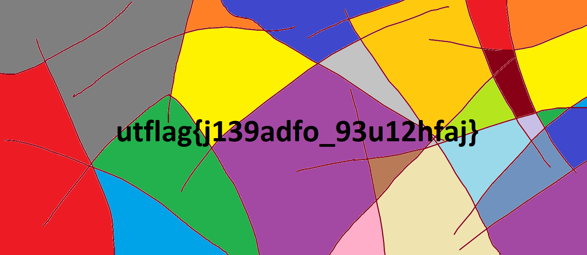

[](ctf=utctf-2020)
[](type=reversing)
[](tags=png)
[](tools=PIL,python,xxd)

# PNG2

We are given a [binary file](../pic.png2).

```
$ xxd pic.png2 | head
00000000: 504e 4732 7769 6474 683d 05cf 6865 6967  PNG2width=..heig
00000010: 6874 3d02 887f 7f7f 7f7f 7f7f 7f7f 7f7f  ht=.............
00000020: 7f7f 7f7f 7f7f 7f7f 7f7f 7f7f 7f7f 7f7f  ................
00000030: 7f7f 7f7f 7f7f 7f7f 7f7f 7f7f 7f7f 7f7f  ................
00000040: 7f7f 7f7f 7f7f 7f7f 7f7f 7f7f 7f7f 7f7f  ................
00000050: 7f7f 7f7f 7f7f 7f7f 7f7f 7f7f 7f7f 7f7f  ................
00000060: 7f7f 7f7f 7f7f 7f7f 7f7f 7f7f 7f7f 7f7f  ................
00000070: 7f7f 7f7f 7f7f 7f7f 7f7f 7f7f 7f7f 7f7f  ................
00000080: 7f7f 7f7f 7f7f 7f7f 7f7f 7f7f 7f7f 7f7f  ................
00000090: 7f7f 7f7f 7f7f 7f7f 7f7f 7f7f 7f7f 7f7f  ................
```

Reading the `width` and `height` as big endian `uint16's` and passing the pixel
data to `PIL` gives us the image.

Script is [here](./solve.py).


