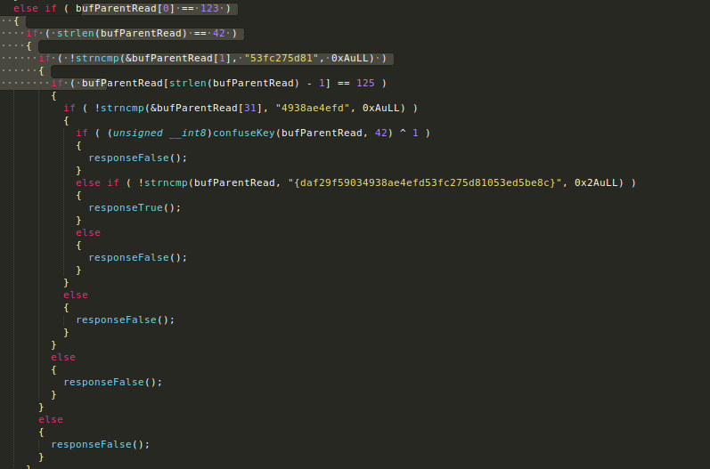
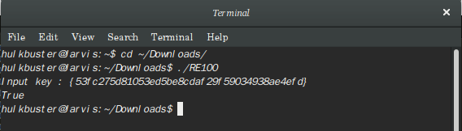

# RE3 (rev 100)

We're given the Binary. When opened and analysed with IDA and exported the C file we come across the code line below.

Thus understanding the codeline yields the following to be the tokens.

1.{53fc275d81daf29f5903053ed5be8c4938ae4efd}
2.{53fc275d81053ed5be8cdaf29f59034938ae4efd}

When input the token results True which gives the flag.

